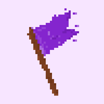
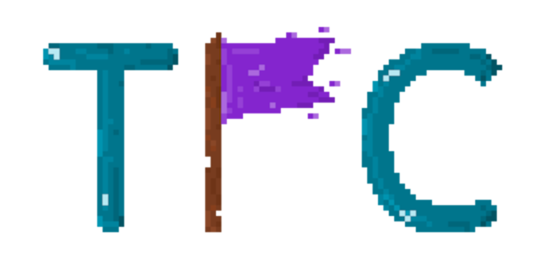

# TheFewChosen

 

The Few Chosen organizes its first CTF event between 26th-28th November. We are a group of 5 students that have participated in numerous CTFs, and our passion for cybersecurity encouraged us to host our own.

We have developed the website from the ground up to ensure that the participants will have the best experience. We are going to have challenges from Pwn, Reverse, Web, Crypto, Misc. The CTF is for everyone, no matter the knowledge, as the challenges are rated from "Warmup" to "Hard". This CTF is the perfect occasion for beginners to learn their way through cybersecurity and experts who want to test their skills.

## Links

### Writeups

You can find some writeups here in the github-repo or on [it-sec.fail](https://www.it-sec.fail).

### Official

[CTFTime Event](https://ctftime.org/event/1501)
[TFCCTF Link](https://github.com/it-sec-fail/TheFewChosen)

## FAQ & Rules

 - The CTF starts at Fri Nov 26 2021 14:00 GMT+2 and ends at Sun Nov 28 2021 14:00 GMT+2
 - NO usage of any automated tools such as: nmap, gobuster | other.
 - Teams are only allowed to participate under one name
 - There may only be a maximum of 5 players in a team
 - Registration is open until the end of the game
 - Cross-teaming and flag hoarding are strictly forbidden
 - All flags must respect this format: `TFCCTF{[a-zA-Z0-9\?=\/\\:\.~!@#$%^&\*()_\+=\-]+}` unless specified otherwise
   Example flag: `TFCCTF{Fl4Gs_f0r_3v3ry0n3!!!^@&#@$?~:}`
 - There are challenges for everyone. Each challenge has a rating (warmup, easy, medium, hard)
 - There is a dynamic score system. This means that the more teams solve a challenge, the less points the following teams will get
 - Official writeups will be released at the end of the CTF. Community writeups are strongly encouraged
 - You can join our Discord server for announcements, help and memes: [https://discord.gg/nVYv3mHKUf](https://discord.gg/nVYv3mHKUf)
 - Have fun!
 - Prizes:
   - Wolfram:
     - 1 Year Wolfram|One Personal Edition (top 12 teams) (1 for each teammate)
     - 1 Year Wolfram|Alpha Pro (top 12 teams) (1 for each teammate)
   - Bitdefender:
     - 1 Year Bitdefender TOTAL SECURITY (top 3 teams) (1 for each teammate)
