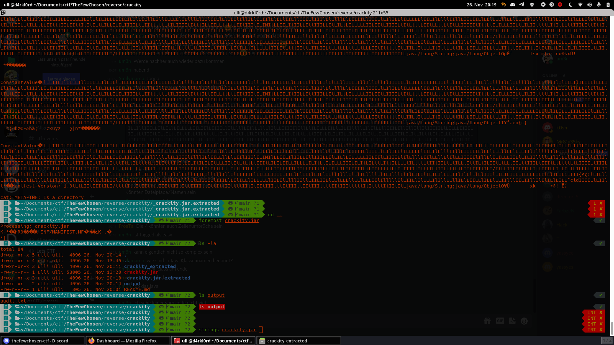

# JUMPY
I like jumping

[jumpy](jumpy)

nc server.challenge.ctf.thefewchosen.com 1337

## todos 

First I looked into the program with strings and after that I looked into the main function.

Okay - looks like this programm does not so much. I'll make it executable and then we can have a look.

Looks like a bufferoverflow then.

----

No clue about solving that ... looking forward to read writeups.